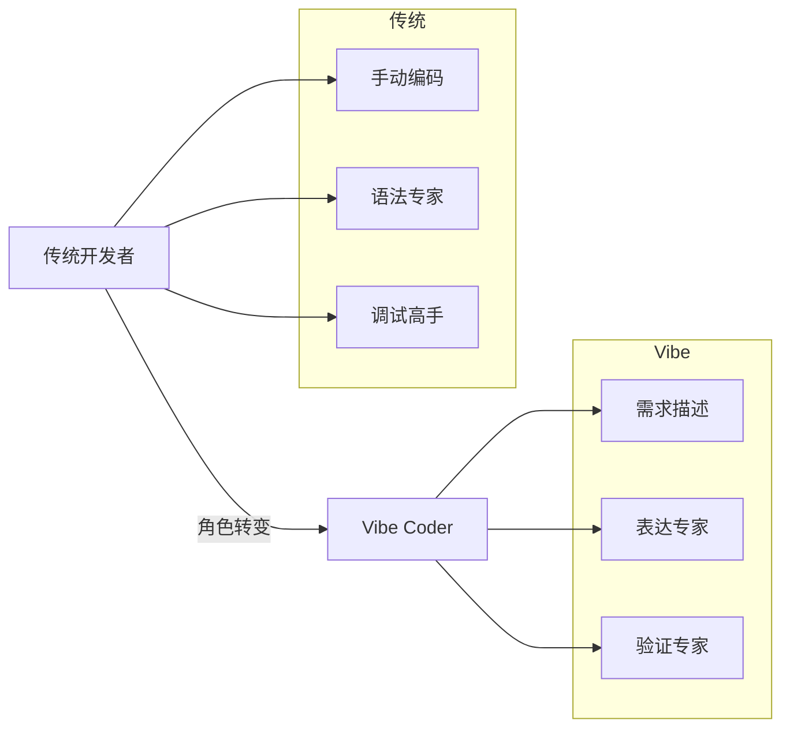

# 什么是 Vibe Coding

## 定义与起源

**Vibe Coding**（氛围编程）是由 AI 研究员 **Andrej Karpathy** 于 ==2025年2月== 提出的概念。

> [!info] 关于 Andrej Karpathy
> - OpenAI 早期成员、研究员（2015–2017）
> - 前特斯拉 Autopilot 视觉/AI 负责人（2017–2022）
> - 斯坦福大学博士（2015）

### 原始定义

> [!quote] Karpathy 原话
> "There's a new kind of coding I call 'vibe coding', where you fully give in to the vibes, embrace exponentials, and forget that the code even exists. It's possible because the LLMs (e.g. Cursor Composer w Sonnet) are getting too good."
>
> 有一种新的编程方式我称之为"氛围编程"，你完全沉浸在氛围中，拥抱指数级增长，==忘记代码的存在==。

### 工作方式描述

Karpathy 在原推文中描述的“vibe coding”方式包括：
- 使用 SuperWhisper 与 Cursor Composer 交流，几乎不碰键盘
- 主要关注“看—说—运行—复制”的结果导向流程
- 经常直接 “Accept All”，不再阅读 diff
- 遇到错误消息直接复制粘贴给模型处理

---

## 核心理念

### 传统编程 vs Vibe Coding

| 维度 | 传统编程 | Vibe Coding |
|:---:|:---:|:---:|
| **输入方式** | 键盘敲代码 | 自然语言描述 |
| **核心技能** | 编程语言语法 | 清晰表达需求 |
| **调试方式** | 阅读代码找bug | 描述期望行为 |
| **工作流程** | 写代码→测试→修改 | 描述→生成→验证→迭代 |
| **角色定位** | 代码编写者 | ==需求引导者== |

### 角色转变

---

## 行业现状

> [!success] 行业观察
> - 目前缺乏权威公开数据能准确量化“AI 生成代码占比”
> - 讨论更集中在效率提升与风险控制（安全、可维护性）
> - 若需量化结论，请以官方报告与可核验来源为准

### 时间线

- **2024-11-25**：Anthropic 开源发布 MCP（Model Context Protocol）
- **2025年2月初**：Karpathy 在 X 上提出 “vibe coding”
- **2025-03-19**：Simon Willison 发布分析文章，区分 vibe coding 与负责任的 AI 辅助开发
- **2025-10-07**：Simon Willison 提出 “vibe engineering”
- **2025-12-09**：Anthropic 将 MCP 捐赠给 Linux Foundation（AAIF）

### 争议与讨论

> [!warning] 讨论焦点
> Simon Willison 指出，“vibe coding”特指在几乎不审查代码的情况下使用 AI，并不等同于负责任的 AI 辅助开发。

> [!danger] 风险警告
> 开发者可能会在不完全理解其功能的情况下使用AI生成的代码，导致：
> - 未被发现的 bug
> - 逻辑错误
> - ==安全漏洞==

---

## 适用场景

### 推荐使用 ✅

- [x] 快速原型验证
- [x] 内部工具（Dashboard、Admin后台）
- [x] 数据分析脚本
- [x] 自动化流程
- [x] Landing Page
- [x] 用户研究 Demo
- [x] 周末个人项目

### 谨慎使用 ⚠️

- [ ] 涉及用户数据安全的功能
- [ ] 支付相关功能
- [ ] 需要高并发/高可用的系统
- [ ] 需要长期维护的核心产品
- [ ] 金融/医疗等合规系统

---

## 延伸阅读

- [[02 - 为什么PM需要学习]]
- [[10 - 提示词工程]]
- [[11 - 安全与风险管理]]

## 参考资料

- [Andrej Karpathy - Wikipedia](https://en.wikipedia.org/wiki/Andrej_Karpathy)
- [Karpathy 原推文](https://x.com/karpathy/status/1886192184808149383)
- [Not all AI-assisted programming is vibe coding - Simon Willison](https://simonwillison.net/2025/Mar/19/vibe-coding/)
- [Vibe engineering - Simon Willison](https://simonwillison.net/2025/Oct/7/vibe-engineering/)
- [Introducing the Model Context Protocol - Anthropic](https://www.anthropic.com/news/model-context-protocol)
- [Donating the Model Context Protocol - Anthropic](https://www.anthropic.com/news/donating-the-model-context-protocol-and-establishing-of-the-agentic-ai-foundation)
- [Linux Foundation AAIF announcement](https://www.linuxfoundation.org/press/linux-foundation-announces-the-formation-of-the-agentic-ai-foundation)
- [Vibe Coding - Wikipedia](https://en.wikipedia.org/wiki/Vibe_coding)
- [What is Vibe Coding? - IBM](https://www.ibm.com/think/topics/vibe-coding)

---

**下一章**：[[02 - 为什么PM需要学习]] →
