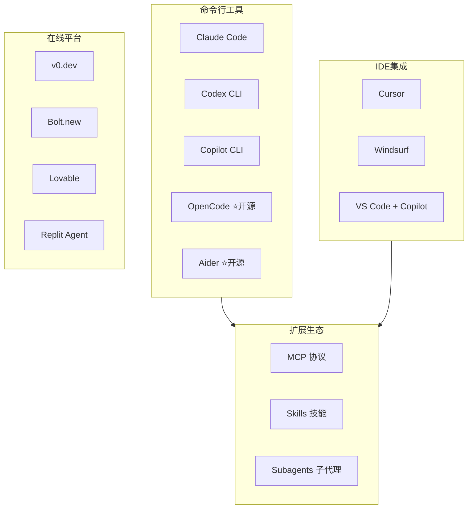
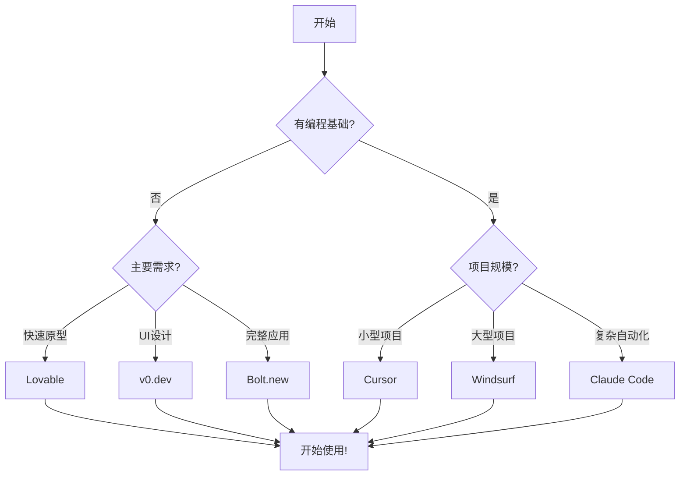

# 工具全景图

## 工具生态总览



---

## 工具分类详解

### 命令行工具 (Terminal)

> [!info] 特点
> - 运行在终端中
> - 深度代码理解能力
> - 适合复杂项目和自动化

| 工具 | 提供商 | 主要特性 | 备注 |
|:---|:---|:---|:---|
| [[05 - Claude Code 安装配置\|Claude Code]] | Anthropic | 官方 CLI、支持 MCP | 订阅/Console 认证，见官方文档 |
| [[06 - Codex CLI 安装配置\|Codex CLI]] | OpenAI | 官方 CLI、本地代理 | ChatGPT 订阅或 API Key |
| Copilot CLI | GitHub | 终端内 Copilot | Public Preview，需 Copilot 订阅 |
| [[07.5 - 进阶工具与配置#OpenCode\|OpenCode]] | 开源 | 本地优先、多模型 | 安装与配置见官方文档 |
| [[07.5 - 进阶工具与配置#Aider\|Aider]] | 开源 | Git 集成、支持多模型 | 安装与模型见官方文档 |

### IDE集成工具 (编辑器)

> [!info] 特点
> - 图形界面，直观友好
> - 实时代码补全
> - 适合日常开发

| 工具 | 基础 | 价格 | 特点 |
|:---|:---|:---:|:---|
| [[08 - IDE工具详解#Cursor\|Cursor]] | VS Code Fork | $20/月 | AI优先设计、Composer 多文件 |
| [[08 - IDE工具详解#Windsurf\|Windsurf]] | 独立 + 插件 | $15/月 | Windsurf Editor + VS Code/JetBrains 插件 |
| VS Code + Copilot | VS Code | $10/月起 | 多模型支持（OpenAI/Anthropic/Google） |

### 在线平台 (浏览器)

> [!info] 特点
> - 无需安装，浏览器直接使用
> - 上手最简单
> - ==最适合PM入门==

| 平台 | 特点 | 最适合 |
|:---|:---|:---|
| [[09 - 在线平台入门#Lovable\|Lovable]] | 代码质量高、界面友好 | ==初学者首选== |
| [[09 - 在线平台入门#v0\|v0.dev]] | Vercel出品、UI组件 | 前端组件设计 |
| [[09 - 在线平台入门#Bolt\|Bolt.new]] | 浏览器内Node.js | 全栈原型 |
| Replit Agent | 最自主、30+集成 | 完整应用 |

---

## 工具对比速查表

### 综合对比

| 工具 | 类型 | 难度 | 适合场景 | 价格（以官网为准） |
|:---|:---:|:---:|:---|:---:|
| **Lovable** | 在线 | ⭐ | 快速原型、Landing Page | 免费 / Pro $25/月 |
| **v0.dev** | 在线 | ⭐ | UI组件、前端页面 | 免费 / $20/月 |
| **Bolt.new** | 在线 | ⭐⭐ | 全栈应用原型 | 见官网 |
| **Replit Agent** | 在线 | ⭐⭐ | 完整应用开发 | Replit Core $20/月（年付） |
| **Cursor** | IDE | ⭐⭐⭐ | 日常开发、代码编辑 | $20/月起 |
| **Windsurf** | IDE | ⭐⭐⭐ | 大型项目、多文件 | $15/月起 |
| **Claude Code** | CLI | ⭐⭐⭐ | 复杂项目、自动化 | 订阅或 Console 计费 |
| **Codex CLI** | CLI | ⭐⭐⭐ | 代码任务、自动化 | ChatGPT 订阅或 API |
| **OpenCode** | CLI | ⭐⭐⭐ | ==开源替代、多模型== | 开源（模型费用另计） |
| **Aider** | CLI | ⭐⭐⭐ | 开源、Git集成 | 开源（模型费用另计） |

### 功能特性对比

> [!note] 说明
> 以下为主观评分，仅供快速对比，具体能力以官方文档为准。

```
功能           Lovable  v0    Cursor  Claude   OpenCode  Aider
───────────────────────────────────────────────────────────────
零代码基础     ★★★★★  ★★★★★ ★★★☆☆  ★★☆☆☆   ★★☆☆☆   ★★☆☆☆
代码质量       ★★★★☆  ★★★★★ ★★★★★  ★★★★★   ★★★★☆   ★★★★☆
开源免费       ☆☆☆☆☆  ☆☆☆☆☆ ☆☆☆☆☆  ☆☆☆☆☆   ★★★★★   ★★★★★
多模型支持     ☆☆☆☆☆  ☆☆☆☆☆ ★★★☆☆  ☆☆☆☆☆   ★★★★★   ★★★★★
MCP/Skills    ☆☆☆☆☆  ☆☆☆☆☆ ☆☆☆☆☆  ★★★★★   ★★★☆☆   ☆☆☆☆☆
本地隐私       ☆☆☆☆☆  ☆☆☆☆☆ ★★☆☆☆  ★★☆☆☆   ★★★★★   ★★★★★
```

---

## 推荐学习路径

### 按角色推荐

> [!tip] 产品经理
> ```
> Week 1: Lovable / v0.dev
> Week 2: Bolt.new
> Week 3: Cursor
> Week 4+: Claude Code（可选）
> ```

> [!tip] 研发人员
> ```
> Week 1: Cursor
> Week 2: Claude Code + MCP
> Week 3+: 深入使用
> ```

> [!tip] 设计师
> ```
> Week 1: v0.dev
> Week 2: Lovable
> Week 3: Cursor（可选）
> ```

### 按场景推荐

| 场景 | 推荐工具 | 原因 |
|:---|:---|:---|
| 快速出UI原型 | Lovable, v0 | 速度快，效果好 |
| 完整功能Demo | Bolt, Replit | 支持后端 |
| 给研发的参考代码 | Cursor, Claude Code | 代码质量高 |
| 技术可行性验证 | Claude Code | 深度分析能力 |
| 学习新技术 | Cursor | 有引导，边学边做 |

---

## 工具组合策略

> [!success] 推荐组合
>
> **快速验证组合**：
> - v0 (UI设计) + Lovable (交互实现) + Bolt (后端逻辑)
>
> **日常开发组合**：
> - Cursor (编码) + Claude Code (复杂任务) + MCP (外部集成)
>
> **开源优先组合**：
> - ==OpenCode + Aider + 本地模型（成本最低）==
>
> **全能组合**：
> - Cursor + Claude Code + Skills + Subagents

---

## 如何选择



---

## 参考资料

- [Claude Code Setup](https://code.claude.com/docs/en/setup)
- [Codex CLI](https://developers.openai.com/codex/cli)
- [GitHub Copilot Plans](https://github.com/features/copilot/plans)
- [GitHub Copilot Supported Models](https://docs.github.com/en/copilot/reference/ai-models/supported-models)
- [Cursor Pricing](https://cursor.com/pricing)
- [Cursor Security](https://cursor.com/security)
- [Windsurf Pricing](https://windsurf.com/pricing)
- [Windsurf Security](https://windsurf.com/security)
- [Lovable Pricing](https://lovable.dev/pricing)
- [v0 Pricing](https://v0.app/pricing)
- [Bolt Pricing](https://bolt.new/pricing)
- [Replit Pricing](https://replit.com/pricing)
- [OpenCode Docs](https://opencode.ai/docs)
- [Aider Docs](https://aider.chat/docs/)

---

**上一章**：← [[02 - 为什么PM需要学习]]
**下一章**：[[04 - 环境准备]] →
