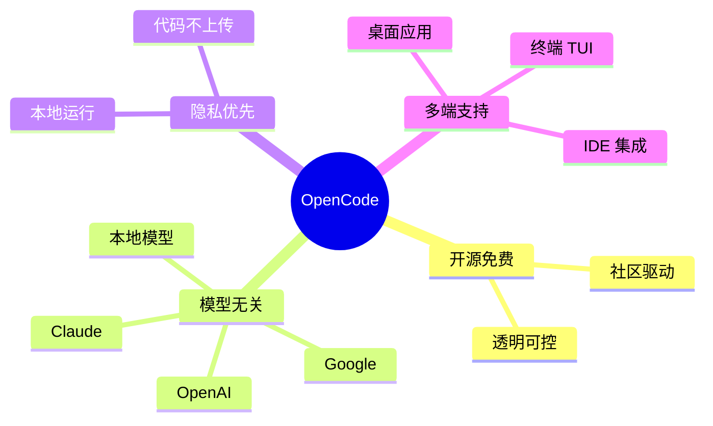

# 进阶工具与配置

> [!important] 本章要点
> 本章介绍更高级的开源工具和深度配置方法，适合有一定基础后进阶学习

---

## OpenCode

### 简介

> [!info] OpenCode 概览
> - **GitHub Stars**：实时变化（以仓库为准）
> - **类型**：开源 AI 编程代理
> - **特点**：本地优先、模型无关

**官网**：[opencode.ai](https://opencode.ai)
**GitHub**：[github.com/anomalyco/opencode](https://github.com/anomalyco/opencode)

### 核心优势



### 安装

```bash
# macOS / Linux
curl -fsSL https://opencode.ai/install | bash

# npm 安装
npm install -g opencode-ai

# macOS / Linux (Homebrew)
brew install anomalyco/tap/opencode

# Windows (Scoop)
scoop bucket add extras
scoop install extras/opencode
```

### 基本使用

```bash
# 启动交互模式
opencode

# 指定模型
opencode --model claude-sonnet

# 使用本地模型
opencode --model ollama:llama3
```

### 与 Claude Code 对比

| 特性 | Claude Code | OpenCode |
|:---|:---:|:---:|
| 开源 | ❌ | ✅ |
| 模型选择 | Claude only | ==多模型== |
| 隐私 | 云端处理 | 本地优先 |
| 价格 | API 计费 | 免费 + 模型费 |
| MCP 支持 | ✅ 原生 | ✅ 兼容 |
| Skills | ✅ | 🔄 兼容层 |

### GitHub 集成

OpenCode 提供 GitHub 集成能力，具体配置与命令以官方文档为准：
- https://opencode.ai/docs/github

---

## Oh My OpenCode

### 简介

> [!tip] 增强版 OpenCode
> Oh My OpenCode 是 OpenCode 的"电池全装"版，添加了多模型工作流、后台代理、LSP 集成等高级功能

**官网**：[ohmyopencode.com](https://ohmyopencode.com)
**GitHub**：[github.com/code-yeongyu/oh-my-opencode](https://github.com/code-yeongyu/oh-my-opencode)

### 核心特性

#### Sisyphus 代理

> [!info] 说明
> Oh My OpenCode 提供更强的代理编排能力（以官方文档为准）。

#### 多模型支持

```
可以同时使用多个模型：
- 一个负责推理
- 一个负责代码生成
- 一个负责审查
```

#### 专业化代理

| 代理 | 功能 |
|:---|:---|
| Oracle | 智能问答 |
| Librarian | 代码搜索 |
| Frontend Engineer | 前端专家 |

#### LSP 集成

- 代码分析
- 类型检查
- 智能重构

### 安装

```bash
# 前置：安装 OpenCode
curl -fsSL https://opencode.ai/install | bash

# 安装 Oh My OpenCode
bunx oh-my-opencode install

# 或使用 npm
npx oh-my-opencode install
```

---

## Aider

### 简介

> [!info] Aider 概览
> - **类型**：开源 AI 配对编程工具
> - **特点**：支持多语言，Git 集成
> - **模型**：可连接多家 LLM 提供商

**官网**：[aider.chat](https://aider.chat)
**GitHub**：[github.com/Aider-AI/aider](https://github.com/Aider-AI/aider)

### 核心特性

- [x] **多模型支持**：可连接多家 LLM 提供商
- [x] **多语言支持**：覆盖常见编程语言
- [x] **Git 集成**：与仓库协作
- [x] **代码地图**：理解整个代码库
- [x] **Lint/Test**：支持调用 lint 与测试
- [x] **语音输入**：支持语音编程

### 安装

```bash
# pip 安装
pip install aider-chat

# 使用 Claude
export ANTHROPIC_API_KEY=sk-ant-xxx
aider --model claude-3-5-sonnet

# 使用本地模型
aider --model ollama/llama3
```

### 聊天模式

| 模式 | 用途 |
|:---|:---|
| `/architect` | 规划设计 |
| `/ask` | 询问问题 |
| `/code` | 编写代码 |
| `AI?` 注释 | 代码中请求帮助 |

### 成本

> [!note] 成本取决于所选模型与计费方式，详见各模型提供商。

---

## Claude Code Skills 系统

### 什么是 Skills

> [!info] Skills 定义
> Skills 是教会 Claude 如何以可重复方式执行任务的专门文件夹，包含指令、脚本和资源。

### Skills vs 其他配置

| 配置方式 | 触发方式 | 用途 |
|:---|:---|:---|
| **CLAUDE.md** | 自动加载 | 项目规范、常量 |
| **Skills** | ==自动发现== | 领域知识、模式 |
| **Slash Commands** | 手动 `/xxx` | 显式触发任务 |
| **Subagents** | 主代理调用 | 隔离上下文 |
| **MCP** | 工具调用 | 外部能力 |

### 目录结构

```
.claude/
├── agents/           # 自定义子代理
│   └── code-reviewer.md
├── commands/         # 斜杠命令
│   └── review.md
└── skills/           # 技能
    ├── react-patterns/
    │   └── SKILL.md
    └── api-design/
        └── SKILL.md
```

### 创建 Skill

创建 `.claude/skills/my-skill/SKILL.md`：

```yaml
---
name: React 最佳实践
description: 团队的 React 开发规范和模式
globs:
  - "**/*.tsx"
  - "**/*.jsx"
---

# React 开发规范

## 组件规范
- 使用函数组件
- Props 必须定义 TypeScript 类型
- 使用 React.memo 优化渲染

## Hooks 规范
- 自定义 Hook 以 use 开头
- 避免在条件语句中使用 Hook

## 示例

```tsx
interface ButtonProps {
  label: string;
  onClick: () => void;
}

export const Button: React.FC<ButtonProps> = ({ label, onClick }) => {
  return <button onClick={onClick}>{label}</button>;
};
```
```

### Skills 资源

- **官方文档**：[Claude Code Skills](https://code.claude.com/docs/en/skills)
- **社区集合**：[awesome-claude-skills](https://github.com/travisvn/awesome-claude-skills)

---

## CLAUDE.md 配置

### 作用

> [!important] 最重要的配置文件
> CLAUDE.md 是 Claude Code 的"宪法"，是代理理解项目的首要信息源

### 推荐内容

```markdown
# 项目名称

## 技术栈
- 前端：React 19 + TypeScript
- 后端：Node.js + Express
- 数据库：PostgreSQL

## 目录结构
- src/components - React 组件
- src/api - API 路由
- src/utils - 工具函数

## 代码规范
- 使用函数组件，禁止 class 组件
- 使用 TypeScript，禁止 any
- 遵循 Airbnb 风格指南

## 常用命令
- npm run dev - 启动开发服务器
- npm test - 运行测试
- npm run lint - 代码检查

## 注意事项
- API Key 从环境变量读取
- 所有 API 需要认证
```

### 层级

```
优先级（高→低）：
1. 项目根目录 CLAUDE.md
2. 子目录 CLAUDE.md
3. ~/.claude/CLAUDE.md（全局）
```

---

## Subagents（子代理）

### 什么是 Subagents

> [!info] 子代理定义
> 子代理是独立的迷你代理，有自己的系统提示、工具权限和上下文窗口，主代理可以委派任务给它们

### 内置 Subagents

| 代理 | 功能 | 工具 |
|:---|:---|:---|
| **Explore** | 代码探索、搜索 | Read, Grep, Glob |
| **Plan** | 规划模式下收集上下文 | Read, Grep, Glob |
| **General** | 复杂多步骤任务 | 全部工具 |

### 创建自定义 Subagent

创建 `.claude/agents/code-reviewer.md`：

```yaml
---
name: Code Reviewer
description: 专业代码审查代理
model: claude-sonnet-4-20250514
tools:
  - Read
  - Grep
  - Glob
---

你是一个专业的代码审查者。

## 审查重点
1. 安全漏洞
2. 性能问题
3. 代码可读性
4. 最佳实践

## 输出格式
- 使用严重程度标记：🔴 高 🟡 中 🟢 低
- 提供具体的改进建议
```

### 使用 Subagent

```
> 使用 code-reviewer 审查 src/api/user.ts
```

### Subagent 资源

- **官方文档**：[code.claude.com/docs/en/sub-agents](https://code.claude.com/docs/en/sub-agents)
- **社区集合**：[github.com/VoltAgent/awesome-claude-code-subagents](https://github.com/VoltAgent/awesome-claude-code-subagents)

---

## 工具组合推荐

### 开源优先组合

```
OpenCode + Oh My OpenCode + Aider
├── 完全开源
├── 多模型自由切换
├── 本地隐私保护
└── 成本可控
```

### 企业级组合

```
Claude Code + Skills + Subagents + MCP
├── 深度定制
├── 团队协作
├── 企业合规
└── 扩展性强
```

### PM 推荐组合

```
在线平台 + Cursor + (OpenCode 可选)
├── Lovable/v0（快速原型）
├── Cursor（日常开发）
└── OpenCode（尝鲜开源）
```

---

## 参考资源

| 资源 | 链接 |
|:---|:---|
| OpenCode 文档 | https://opencode.ai/docs |
| Oh My OpenCode | https://ohmyopencode.com |
| Aider 文档 | https://aider.chat/docs |
| Claude Code Skills | https://code.claude.com/docs/en/skills |
| Claude Code Subagents | https://code.claude.com/docs/en/sub-agents |
| Awesome Claude Skills | https://github.com/travisvn/awesome-claude-skills |

---

**上一章**：← [[07 - MCP 配置指南]]
**下一章**：[[08 - IDE工具详解]] →
