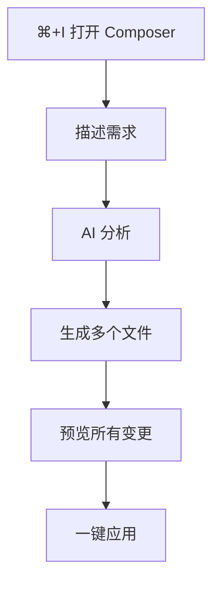
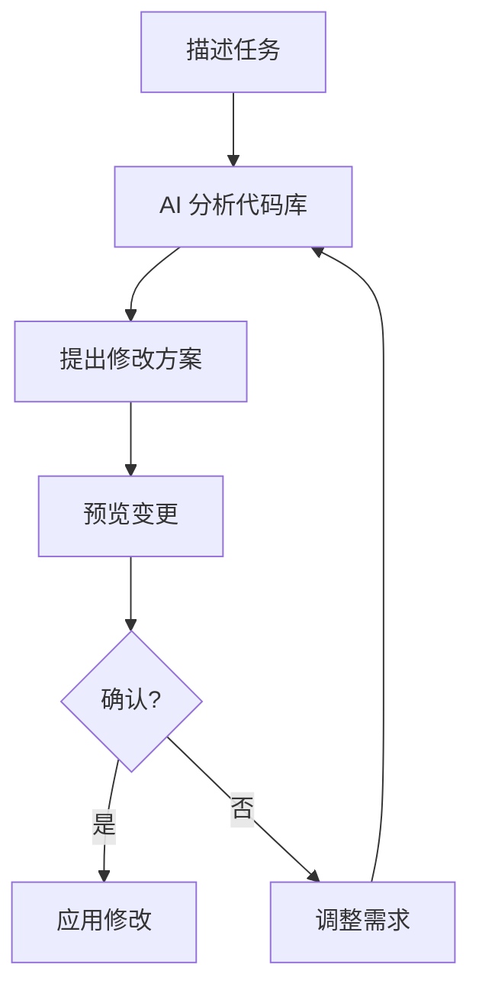
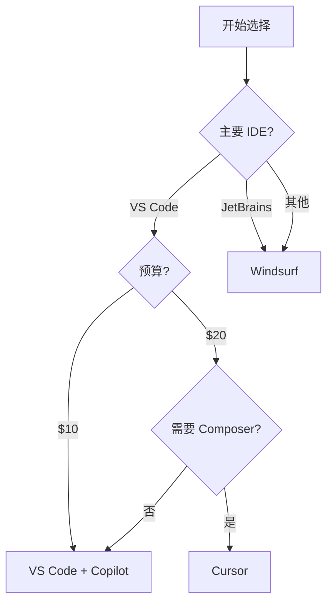

# IDE工具详解

> [!info] IDE 工具特点
> - 图形界面，直观友好
> - 实时代码补全
> - 适合日常开发
> - 比命令行工具更易上手

---

## Cursor

### 简介

> [!quote] Cursor 定位
> Cursor 不是一个带 AI 的编辑器，而是一个 ==AI 工具，恰好也是编辑器==

- **基础**：VS Code Fork
- **价格**：$20/月起（见官方定价）
- **定价与功能**：以官方页面为准

### 安装

1. 访问 [cursor.com](https://cursor.com)
2. 下载对应系统安装包
3. 安装并登录

### 核心功能

#### 快捷键速查

| 功能 | macOS | Windows/Linux |
|:---|:---|:---|
| Chat 对话 | `⌘ + L` | `Ctrl + L` |
| Inline 编辑 | `⌘ + K` | `Ctrl + K` |
| Composer | `⌘ + I` | `Ctrl + I` |
| 接受建议 | `Tab` | `Tab` |
| 拒绝建议 | `Esc` | `Esc` |

#### Chat（对话）


**使用场景：**
- 理解代码
- 寻求建议
- 学习新技术

#### Inline Edit（行内编辑）


**使用场景：**
- 快速重构
- 添加注释
- 修改函数

#### Composer（多文件编辑）

> [!success] Composer 是 Cursor 的杀手级功能
> 可以同时创建和编辑多个文件



**示例提示词：**
```
创建一个用户注册功能：
- 在 components/ 下创建 RegisterForm 组件
- 在 api/ 下创建 register 接口
- 在 hooks/ 下创建 useRegister hook
- 添加表单验证
```

### 高效使用技巧

#### @ 符号引用

```
@file:src/api/user.ts 这个文件中的 getUser 函数有什么问题？

@folder:src/components 这个目录下的组件都遵循什么模式？

@web React 19 有哪些新特性？

@docs 查看 Next.js 的路由文档
```

#### 项目规则配置

创建 `.cursorrules` 文件：

```markdown
# 项目规则

## 技术栈
- React 19 + TypeScript
- Tailwind CSS
- Zustand 状态管理

## 代码规范
- 使用函数组件和 Hooks
- 组件使用 PascalCase
- 工具函数使用 camelCase
- 遵循 Airbnb 风格指南

## 禁止事项
- 不使用 class 组件
- 不使用 any 类型
- 不使用 var 声明
```

#### Tab 补全

Cursor 会实时预测你的下一步操作：

- 预测下一行代码
- 预测变量名
- 预测函数参数

> [!tip] 技巧
> 写一个函数签名后，按 Tab 可以自动生成实现

---

## Windsurf

### 简介

- **提供商**：Cognition, Inc.
- **价格**：$15/月
- **特点**：大型项目、多 IDE 支持

### 核心特性

#### Cascade 技术

> [!info] 自动上下文索引
> Windsurf 通过 Cascade 技术自动索引代码库，无需手动选择文件，可处理百万行级代码


#### 多 IDE 支持

Windsurf 提供独立的 Windsurf Editor，并提供 VS Code 与 JetBrains 插件（详情以官方为准）。

#### Flow 工作流



### 与 Cursor 对比

| 特性 | Cursor | Windsurf |
|:---|:---:|:---:|
| 基础 | VS Code Fork | 独立 IDE + 插件 |
| 价格 | $20/月起 | $15/月起 |
| IDE 覆盖 | Cursor 编辑器 | Windsurf Editor + VS Code/JetBrains 插件 |
| 企业合规 | SOC 2 Type II | SOC 2 Type II、FedRAMP High、HIPAA（官方说明） |

### 使用场景推荐

> [!tip] 选择建议
>
> **选 Cursor：**
> - 习惯 VS Code
> - 项目规模中小
> - 注重上手速度
>
> **选 Windsurf：**
> - 使用 JetBrains 等 IDE
> - 大型代码库
> - 企业合规需求

---

## VS Code + GitHub Copilot

### 简介

最成熟、最广泛使用的 AI 编程方案。

- **价格**：$10/月起
- **提供商**：GitHub / Microsoft
- **可用模型**：支持多模型（OpenAI/Anthropic/Google，按计划可用）

### 安装

1. 安装 VS Code
2. 扩展市场搜索 "GitHub Copilot"
3. 安装并登录 GitHub 账号

### 功能概览

| 功能 | 说明 |
|:---|:---|
| 代码补全 | 实时智能补全 |
| Copilot Chat | 侧边栏对话 |
| Inline Chat | 选中代码后对话 |
| Copilot Edits | 多文件编辑（类似 Composer） |

---

## IDE 工具总结

### 功能对比表

```
功能              Cursor    Windsurf   VS Code+Copilot
─────────────────────────────────────────────────────
代码补全          ★★★★★    ★★★★☆     ★★★★★
多文件编辑        ★★★★★    ★★★★★     ★★★★☆
上下文理解        ★★★★☆    ★★★★★     ★★★★☆
学习曲线          简单      中等       简单
VS Code 兼容      完全      插件       完全
```

### 选择决策树



---

## 参考资料

- [Cursor Pricing](https://cursor.com/pricing)
- [Cursor Security](https://cursor.com/security)
- [Windsurf Pricing](https://windsurf.com/pricing)
- [Windsurf Security](https://windsurf.com/security)
- [GitHub Copilot Plans](https://github.com/features/copilot/plans)
- [GitHub Copilot Supported Models](https://docs.github.com/en/copilot/reference/ai-models/supported-models)

---

**上一章**：← [[07 - MCP 配置指南]]
**下一章**：[[09 - 在线平台入门]] →
