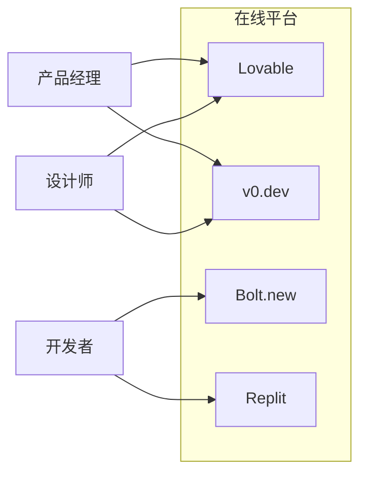
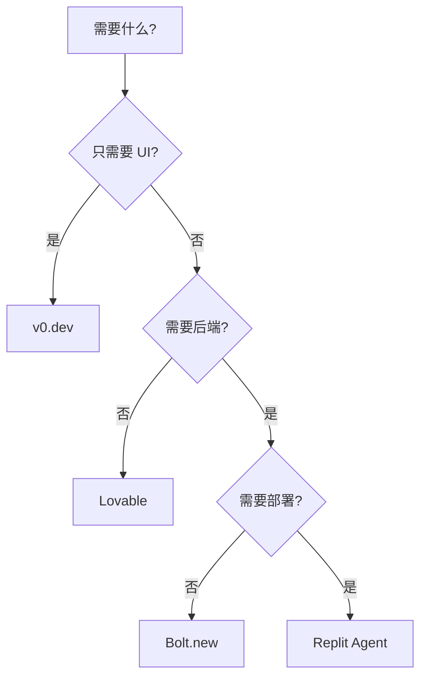

# 在线平台入门

> [!success] 最适合PM入门
> 在线平台无需安装，浏览器直接使用，是 Vibe Coding 的最佳起点

---

## 平台概览



| 平台 | 特点 | 最适合 |
|:---|:---|:---|
| **Lovable** | 代码质量高、界面友好 | ==PM入门首选== |
| **v0.dev** | UI组件、Next.js生态 | 前端设计 |
| **Bolt.new** | 浏览器内全栈 | 全栈原型 |
| **Replit Agent** | 最自主、完整部署 | 完整应用 |

---

## Lovable

### 简介

> [!info] 关于 Lovable
> - AI 全栈应用生成平台
> - 提供可视化编辑与部署能力（以官方为准）

**访问地址**：[lovable.dev](https://lovable.dev)

### 使用流程


### 入门示例

#### 示例1：待办事项应用

```
创建一个待办事项应用：
- 可以添加、删除、标记完成任务
- 任务有标题、描述、截止日期、优先级
- 支持拖拽排序
- 数据保存在本地存储
- 界面简洁现代，使用深色主题
```

#### 示例2：数据看板

```
创建一个销售数据看板：
- 顶部显示4个关键指标卡片：总销售额、订单数、客单价、转化率
- 中间是销售趋势折线图，支持按日/周/月切换
- 底部是销售排行榜表格
- 支持日期范围筛选
- 使用蓝色主题配色
```

#### 示例3：Landing Page

```
创建一个 SaaS 产品的 Landing Page：
- Hero 区域：大标题 + 副标题 + CTA按钮
- 特性展示：3个核心功能卡片
- 定价区域：3个套餐对比
- FAQ 手风琴组件
- 底部 CTA + Footer
- 风格参考 Linear.app
```

### 技巧

> [!tip] Lovable 使用技巧
> 1. **描述要具体**：颜色、布局、交互都要说清楚
> 2. **分步迭代**：先出基础版，再逐步完善
> 3. **提供参考**：可以说"风格参考xxx"
> 4. **善用修改**：不满意的地方直接说，让它修改

---

## v0.dev

### 简介

> [!info] 关于 v0
> - Vercel 出品
> - 专注 UI 组件
> - Next.js + shadcn/ui 生态

**访问地址**：[v0.dev](https://v0.dev)

### 特点

- [x] 生成 React 组件
- [x] 使用 shadcn/ui 组件库
- [x] 支持 Tailwind CSS
- [x] 可直接复制到项目

### 入门示例

#### 示例1：定价组件

```
设计一个定价页面组件：
- 3个套餐：基础版、专业版、企业版
- 包含功能对比表格
- 高亮推荐套餐（专业版）
- 支持月付/年付切换
- 使用 shadcn/ui 风格
```

#### 示例2：用户卡片

```
设计一个用户信息卡片组件：
- 头像（圆形）
- 用户名和职位
- 简介文字（最多3行，超出省略）
- 社交媒体图标链接
- 关注按钮
- 悬停时有微妙的阴影效果
```

#### 示例3：数据表格

```
设计一个数据表格组件：
- 支持排序（点击表头）
- 支持分页
- 支持搜索过滤
- 支持行选择（checkbox）
- 响应式设计
- 加载状态显示骨架屏
```

### 与 Lovable 配合


> [!tip] 组合使用
> - v0 擅长单个精美组件
> - Lovable 擅长完整应用
> - 可以用 v0 设计关键组件，再用 Lovable 做整体

---

## Bolt.new

### 简介

> [!info] 关于 Bolt.new
> - StackBlitz 出品
> - 浏览器内运行完整 Node.js
> - 无需安装、无需配置
> - 支持多种框架

**访问地址**：[bolt.new](https://bolt.new)

### 特点

- [x] 浏览器内全栈开发
- [x] 支持 React、Vue、Svelte、Node.js
- [x] 即时预览
- [x] 可部署到各平台

### 入门示例

#### 示例1：全栈 CRUD

```
创建一个笔记应用：
- 前端用 React + Tailwind
- 后端用 Express + SQLite
- 实现笔记的增删改查
- 支持标签分类
- 支持搜索
```

#### 示例2：API + 前端

```
创建一个天气应用：
- 后端代理天气 API（避免跨域）
- 前端显示当前天气
- 支持搜索城市
- 显示未来5天预报
- 响应式设计
```

### 与其他平台对比

| 特性 | Lovable | v0 | Bolt |
|:---|:---:|:---:|:---:|
| 全栈能力 | ★★★☆☆ | ★★☆☆☆ | ★★★★★ |
| UI 质量 | ★★★★★ | ★★★★★ | ★★★☆☆ |
| 上手难度 | ⭐ | ⭐ | ⭐⭐ |
| 框架选择 | React | React | 多种 |

---

## Replit Agent

### 简介

> [!info] 关于 Replit
> - 最自主的 AI 开发平台
> - Replit Agent 试用包含在免费计划中
> - Core 计划提供完整 Agent 访问

**访问地址**：[replit.com](https://replit.com)

**价格**：Replit Core $20/月（年付）或 $25/月

### 特点

- [x] 最高自主性
- [x] 内置数据库
- [x] 一键部署
- [x] 支持各种语言和框架

### 适用场景

- 完整的 SaaS 应用原型
- 需要后端+数据库的项目
- 需要快速部署的演示

---

## 平台选择指南

### 决策流程



### 场景推荐

| 场景 | 推荐平台 | 原因 |
|:---|:---|:---|
| 给领导演示的 Demo | Lovable | 最快最美 |
| 用研测试原型 | Lovable | 易于迭代 |
| 设计组件参考 | v0 | 代码质量高 |
| 技术可行性验证 | Bolt | 全栈能力 |
| 完整 MVP | Replit | 可部署 |

---

## 最佳实践

### 提示词原则

> [!important] 写好提示词的关键
>
> **1. 具体明确**
> - ❌ "做个好看的页面"
> - ✅ "蓝色主题的登录页面，包含邮箱密码输入框和登录按钮"
>
> **2. 说明上下文**
> - "这是一个B2B SaaS产品"
> - "目标用户是企业管理者"
>
> **3. 提供参考**
> - "风格参考 Linear.app"
> - "布局类似 Notion"
>
> **4. 分步迭代**
> - 先出基础版
> - 再逐步添加功能

### 迭代示例

```
第一轮：
"创建一个任务管理应用，可以添加和显示任务"

第二轮：
"添加任务完成状态切换功能"

第三轮：
"添加任务优先级（高/中/低），用颜色区分"

第四轮：
"添加拖拽排序功能"

第五轮：
"优化移动端显示"
```

---

## 参考资料

- [Lovable Pricing](https://lovable.dev/pricing)
- [v0 Pricing](https://v0.app/pricing)
- [Bolt Pricing](https://bolt.new/pricing)
- [Replit Pricing](https://replit.com/pricing)

---

**上一章**：← [[08 - IDE工具详解]]
**下一章**：[[10 - 提示词工程]] →
