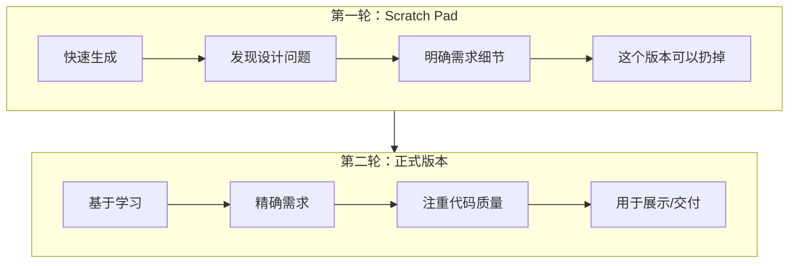
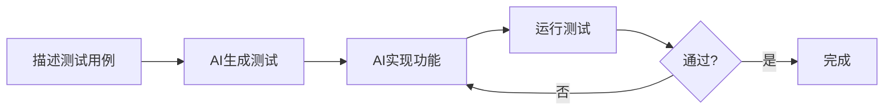

# 提示词工程

> [!quote] 核心原则
> 你说得越清楚，AI 理解得越准确

---

## 提示词设计原则

### SPECIFIC 原则

| 字母 | 原则 | 说明 | 示例 |
|:---:|:---|:---|:---|
| **S** | Specific | 具体明确 | ❌ "好看的页面" ✅ "蓝色主题登录页" |
| **P** | Purpose | 说明目的 | "用于用户研究的可交互原型" |
| **E** | Examples | 提供示例 | "参考 Stripe 的定价页风格" |
| **C** | Constraints | 明确约束 | "使用 React，不用 jQuery" |
| **I** | Iterative | 迭代优化 | 分步骤完成复杂任务 |
| **F** | Feedback | 提供反馈 | "按钮太小了，增大到48px" |
| **I** | Inspect | 检查验证 | 测试生成的代码 |
| **C** | Context | 给出上下文 | "B2B SaaS 产品" |

---

## 提示词模板

### 功能开发模板

```markdown
## 任务
[简要描述要做什么]

## 背景
- 项目类型：[Web/移动/后端等]
- 技术栈：[React/Vue/Node等]
- 目标用户：[用户画像]

## 功能需求
1. [需求1]
2. [需求2]
3. [需求3]

## 约束条件
- [约束1]
- [约束2]

## 参考
- [参考链接或截图]
```

### Bug 修复模板

```markdown
## 问题描述
[简要描述问题]

## 重现步骤
1. [步骤1]
2. [步骤2]

## 期望行为
[应该发生什么]

## 实际行为
[实际发生了什么]

## 错误信息
```
[完整错误堆栈]
```

## 相关文件
- [文件路径1]
- [文件路径2]
```

### 代码审查模板

```markdown
请审查以下代码，关注：
- 安全漏洞
- 性能问题
- 代码可读性
- 最佳实践
- 边界情况处理

文件路径：[路径]
```

---

## 工作流最佳实践

### 两轮迭代法



> [!tip] 核心思想
> 第一个版本只是"草稿"，用来发现问题和明确需求

### 测试驱动开发（TDD）



**示例流程：**

```
第1步：描述期望行为
> "用户输入有效邮箱后点击提交，应该显示成功提示"

第2步：生成测试
> "为这个场景编写测试用例"

第3步：实现功能
> "实现能通过上述测试的代码"

第4步：验证
> 运行测试
```

### 渐进式复杂度

```
Level 1: 静态页面
"创建一个展示产品特性的页面"
        ↓
Level 2: 添加交互
"添加 Tab 切换功能"
        ↓
Level 3: 添加状态
"选中的 Tab 保存到 URL 参数"
        ↓
Level 4: 添加数据
"从 API 获取产品数据"
        ↓
Level 5: 添加边界处理
"添加加载状态和错误处理"
```

---

## 常见反模式

### 避免这些错误

| 反模式 | 问题 | 改进 |
|:---|:---|:---|
| **一次要求太多** | AI 容易遗漏或出错 | ==分步骤描述== |
| **描述太模糊** | 结果不符预期 | 提供具体细节 |
| **不看代码就用** | 可能有安全问题 | 审查关键逻辑 |
| **不测试就交付** | 有未发现的 bug | 测试核心流程 |
| **过度依赖 AI** | 失去判断力 | 你是决策者 |

### 好的 vs 不好的提示词

> [!success] 好的提示词
> ```
> 创建一个用户登录表单：
> - 邮箱输入框，需要格式验证
> - 密码输入框，至少8位
> - 记住我复选框
> - 登录按钮，点击后显示loading状态
> - 表单验证失败时显示红色错误提示
> - 使用 React Hook Form
> - 样式用 Tailwind CSS
> ```

> [!failure] 不好的提示词
> ```
> 做个登录页面
> ```

---

## 高级技巧

### 角色设定

```markdown
你是一个资深 React 开发者，专注于：
- 性能优化
- 可访问性
- 代码可维护性

请帮我...
```

### 链式思考

```markdown
请按以下步骤处理：
1. 首先分析现有代码结构
2. 然后列出需要修改的文件
3. 接着提出修改方案
4. 最后实现代码
```

### 对比分析

```markdown
请对比以下两种实现方式：
方案A：使用 Redux
方案B：使用 Zustand

从以下角度分析：
- 学习曲线
- 性能
- 代码量
- 适用场景
```

### 约束边界

```markdown
在实现时请注意：
- 不要使用 any 类型
- 不要使用 console.log
- 组件不要超过 200 行
- 函数不要超过 50 行
```

---

## Vibe Coding vs Vibe Engineering

> [!info] Simon Willison 的观点
> Vibe Coding 是快速、随意的方式
> **Vibe Engineering** 是系统化、可控的方式

| 维度 | Vibe Coding | Vibe Engineering |
|:---|:---|:---|
| 方式 | 快速、随意 | 系统化、可控 |
| 适用 | 原型 | 生产 |
| 范围 | 个人探索 | 团队协作 |
| 质量 | 不太在意 | ==注重质量== |
| 债务 | 可能有 | 持续可维护 |

### Vibe Engineering 实践

- [x] 建立团队共享的提示词库
- [x] 使用 AGENTS.md 统一规范
- [x] 代码审查 AI 生成的内容
- [x] 版本控制提示词
- [x] 监控 AI 代码的线上表现

---

## 提示词模板库

> [!tip] 建议收藏
> 建立自己的提示词模板库，提高效率

### 常用模板

#### 新功能

```markdown
## 功能：[功能名称]

### 需求
[详细描述]

### 技术要求
- 框架：
- 样式：
- 状态管理：

### 验收标准
1. [ ]
2. [ ]
3. [ ]
```

#### 重构

```markdown
请重构 [文件/模块]：

目标：
- 提高可读性
- 减少重复
- 符合 [设计模式/原则]

约束：
- 保持 API 不变
- 保持向后兼容
```

#### 优化

```markdown
请优化 [文件/函数] 的性能：

当前问题：
[描述性能问题]

期望：
[期望的性能指标]

注意：
- 保持功能不变
- 考虑边界情况
```

---

## 参考资料

- [Not all AI-assisted programming is vibe coding - Simon Willison](https://simonwillison.net/2025/Mar/19/vibe-coding/)
- [Vibe engineering - Simon Willison](https://simonwillison.net/2025/Oct/7/vibe-engineering/)

---

**上一章**：← [[09 - 在线平台入门]]
**下一章**：[[11 - 安全与风险管理]] →
