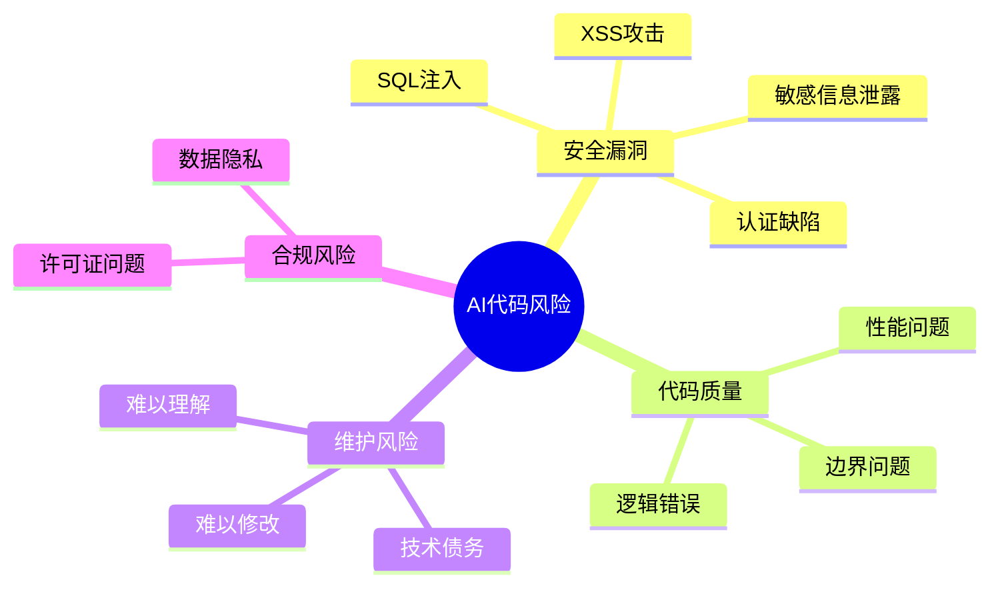
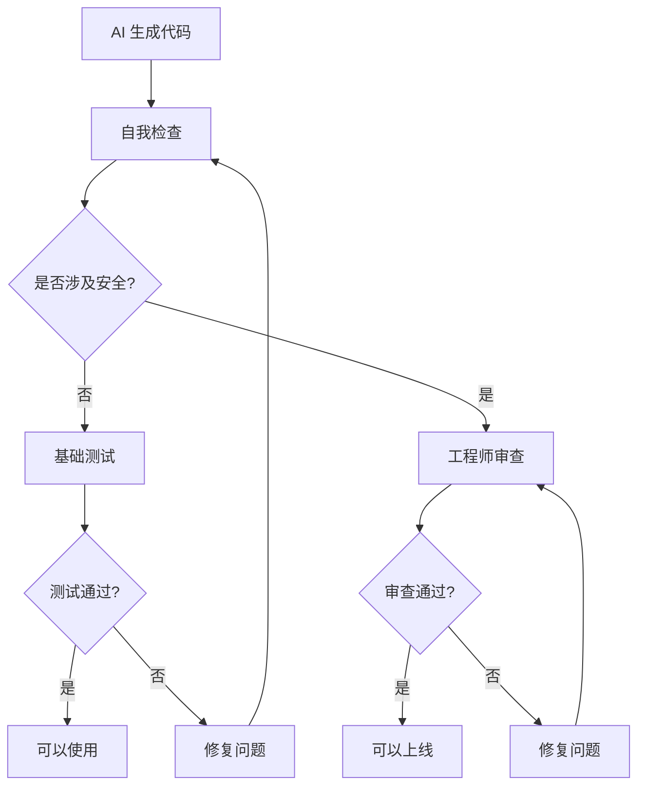

# 安全与风险管理

> [!danger] 重要警告
> Veracode 2025 GenAI 报告：**45% 的 AI 生成代码样本未通过安全测试**，Java 安全失败率 **72%**（其他语言见报告）

---

## 风险概览

### 常见风险类型



### 风险等级划分

| 风险等级 | 场景 | 处理方式 |
|:---:|:---|:---|
| 🟢 低 | 内部原型、个人工具 | 可较放心使用 |
| 🟡 中 | 内部工具、非核心功能 | 需代码审查 |
| 🔴 高 | 用户数据、支付、认证 | ==必须工程师审查== |
| ⛔ 禁止 | 合规系统（金融、医疗） | 不建议使用 |

---

## 安全检查清单

### 基础检查

- [ ] 不在提示词中包含敏感信息（API Key、密码等）
- [ ] 使用环境变量管理密钥
- [ ] 不直接在生产环境使用未审查的代码
- [ ] 了解生成代码的基本逻辑

### 代码审查重点

- [ ] **用户输入处理**
  - 是否有 XSS 防护
  - 是否有 SQL 注入防护
  - 是否验证了输入格式

- [ ] **认证授权**
  - 认证逻辑是否正确
  - 权限检查是否完整
  - Session 管理是否安全

- [ ] **数据处理**
  - 敏感数据是否加密
  - 日志是否包含敏感信息
  - 数据传输是否使用 HTTPS

- [ ] **依赖安全**
  - 第三方包是否有已知漏洞
  - 是否使用了过时的库

---

## 具体防护建议

### 敏感信息保护

> [!warning] 永远不要这样做
> ```javascript
> // ❌ 错误：硬编码密钥
> const API_KEY = "sk-xxx-your-secret-key";
>
> // ❌ 错误：在提示词中包含密钥
> "使用 API Key sk-xxx 调用接口"
> ```

> [!success] 正确做法
> ```javascript
> // ✅ 正确：使用环境变量
> const API_KEY = process.env.API_KEY;
> ```

### SQL 注入防护

> [!failure] 危险代码
> ```javascript
> // ❌ AI 可能生成的危险代码
> const query = `SELECT * FROM users WHERE id = ${userId}`;
> ```

> [!success] 安全代码
> ```javascript
> // ✅ 使用参数化查询
> const query = `SELECT * FROM users WHERE id = $1`;
> db.query(query, [userId]);
> ```

### XSS 防护

> [!failure] 危险代码
> ```javascript
> // ❌ 直接插入用户内容
> element.innerHTML = userInput;
> ```

> [!success] 安全代码
> ```javascript
> // ✅ 使用安全的方法
> element.textContent = userInput;
> // 或使用框架的安全机制（如 React 默认转义）
> ```

---

## 使用原则

### 原型 vs 生产

```mermaid
flowchart TD
    A[AI 生成代码] --> B{用途?}

    B -->|原型/Demo| C[可以快速迭代]
    C --> C1[允许一定程度的"脏代码"]
    C1 --> C2[重点是速度和验证]

    B -->|生产系统| D[必须严格审查]
    D --> D1[工程师参与评审]
    D1 --> D2[完整测试覆盖]
    D2 --> D3[安全扫描]
```

### 三条核心原则

> [!important] 原则一：AI 是助手，你是负责人
> - 生成的代码代表你的判断
> - 出问题你需要承担责任
> - 不要盲目信任

> [!important] 原则二：原型可以随意，生产要谨慎
> - 验证想法时可以快速迭代
> - 上线前必须有工程师把关
> - 核心功能需要额外审查

> [!important] 原则三：保护敏感信息
> - 不要把生产数据给 AI
> - 不要在提示词中包含密钥
> - 使用环境变量和配置管理

---

## 审查流程

### 建议的审查流程



### 自我检查要点

1. **运行代码**：确保基本功能正常
2. **边界测试**：测试空值、极限值
3. **错误处理**：检查是否有适当的错误处理
4. **代码理解**：确保理解关键逻辑

---

## 场景判断

### 场景决策表

| 场景 | 风险等级 | 建议 |
|:---|:---:|:---|
| 个人学习项目 | 🟢 | 放心使用 |
| 内部 Demo | 🟢 | 放心使用 |
| 数据分析脚本 | 🟡 | 检查数据处理逻辑 |
| 内部工具 | 🟡 | 基础审查 |
| 面向用户的功能 | 🔴 | 工程师审查 |
| 用户认证模块 | 🔴 | ==必须专业审查== |
| 支付相关 | 🔴 | ==必须专业审查== |
| 金融/医疗系统 | ⛔ | 不建议使用 |

---

## 常见安全问题

### OWASP Top 10 检查

> [!warning] AI 代码常见的安全问题
>
> 1. **注入攻击**（SQL、NoSQL、LDAP）
> 2. **认证缺陷**
> 3. **敏感数据暴露**
> 4. **XML 外部实体（XXE）**
> 5. **访问控制缺陷**
> 6. **安全配置错误**
> 7. **跨站脚本（XSS）**
> 8. **不安全的反序列化**
> 9. **使用含已知漏洞的组件**
> 10. **日志和监控不足**

### 如何要求 AI 注意安全

```markdown
请实现用户登录功能，注意：
- 密码需要加盐哈希存储
- 实现登录失败次数限制
- 使用 HTTPS 传输
- Session 设置 HttpOnly 和 Secure 标志
- 防止时序攻击
- 日志不要记录密码
```

---

## 总结

> [!tip] 记住这些关键点
>
> 1. **45% 的 AI 代码有安全问题** —— 不要盲目信任
> 2. **原型可以快，生产要严** —— 区分使用场景
> 3. **你是最后的把关人** —— 对代码负责
> 4. **敏感信息要保护** —— 不要泄露给 AI
> 5. **涉及安全找工程师** —— 专业的事交给专业的人

---

## 参考资料

- [Veracode 2025 GenAI Code Security Report (blog)](https://www.veracode.com/blog/genai-code-security-report)
- [2025 GenAI Code Security Report (report)](https://www.veracode.com/resources/analyst-reports/2025-genai-code-security-report/)

---

**上一章**：← [[10 - 提示词工程]]
**下一章**：[[12 - 常见问题排查]] →
