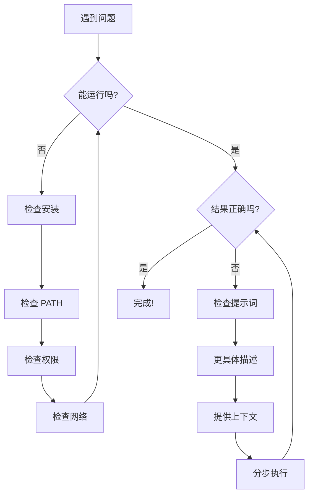

# 常见问题排查

---

## 安装问题

### Node.js 相关

> [!question] Q: `command not found: node`
> **A:** Node.js 未正确安装或未添加到 PATH
>
> **解决方案：**
> ```bash
> # 检查是否安装
> which node
>
> # 如果使用 nvm，重新加载并切到 LTS
> source ~/.nvm/nvm.sh
> nvm install --lts
> nvm use --lts
>
> # 重新打开终端
> ```

> [!question] Q: npm 安装报权限错误（EACCES）
> **A:** 不要使用 `sudo npm install -g`
>
> **正确做法：**
> ```bash
> mkdir ~/.npm-global
> npm config set prefix '~/.npm-global'
> echo 'export PATH=~/.npm-global/bin:$PATH' >> ~/.zshrc
> source ~/.zshrc
> ```

### Claude Code 相关

> [!question] Q: 安装后找不到 `claude` 命令
> **A:** PATH 未正确配置
>
> **解决方案：**
> ```bash
> # 添加到 PATH
> export PATH="$HOME/.claude/bin:$PATH"
>
> # 永久保存
> echo 'export PATH="$HOME/.claude/bin:$PATH"' >> ~/.zshrc
> source ~/.zshrc
>
> # 或运行诊断
> claude doctor
> ```

> [!question] Q: 登录失败或提示无权限
> **A:** Claude Code 使用 Claude 账号 OAuth 登录（不依赖 `ANTHROPIC_API_KEY`）。确认账号具备 Claude Code 访问权限（订阅或 Console 计费开启），然后重试登录。

### Codex CLI 相关

> [!question] Q: Codex 登录失败
> **A:** 确认：
> 1. ChatGPT 订阅有效
> 2. 网络能访问 OpenAI
> 3. 尝试使用 API Key 方式

### Windows 相关

> [!question] Q: Windows 下工具运行异常
> **A:** 强烈建议使用 WSL
>
> **解决方案：**
> ```powershell
> # 安装 WSL
> wsl --install
>
> # 在 WSL 中重新安装工具
> # 项目放在 Linux 文件系统（~/）下
> ```

---

## 使用问题

### AI 生成的代码不能运行

> [!question] Q: 生成的代码报错
> **A:** 按以下步骤排查：
>
> 1. **提供完整错误信息**
>    ```
>    错误信息：[完整错误堆栈]
>    ```
>
> 2. **说明运行环境**
>    ```
>    - Node.js 版本：
>    - 操作系统：
>    - 浏览器：
>    ```
>
> 3. **检查依赖**
>    ```bash
>    npm install
>    ```
>
> 4. **要求分步验证**
>    ```
>    请分步骤验证代码，找出问题所在
>    ```

### AI 不理解需求

> [!question] Q: AI 理解错了我的意思
> **A:** 改进提示词：
>
> 1. **提供更多上下文**
>    - 项目背景
>    - 技术栈
>    - 目标用户
>
> 2. **给出具体示例**
>    - 输入输出示例
>    - 参考设计
>
> 3. **确认理解**
>    ```
>    你理解我的需求了吗？请复述一下
>    ```
>
> 4. **分解任务**
>    - 把大任务拆成小步骤

### 代码风格不一致

> [!question] Q: 生成的代码风格与项目不一致
> **A:** 解决方案：
>
> 1. **提供代码示例**
>    ```
>    参考现有代码风格：[示例]
>    ```
>
> 2. **配置规则文件**
>    - Codex CLI: `AGENTS.md`
>    - Claude Code: `CLAUDE.md`
>    - 其他工具请参考官方文档的规则/指令文件说明
>
> 3. **使用 Linter**
>    ```bash
>    npx eslint --fix .
>    npx prettier --write .
>    ```

---

## MCP 问题

> [!question] Q: MCP 服务器连接失败
> **A:** 诊断步骤：
>
> 1. **检查状态**
>    ```
>    /mcp
>    ```
>
> 2. **启用调试模式**
>    ```bash
>    claude --mcp-debug
>    ```
>
> 3. **检查环境变量**
>    ```bash
>    echo $GITHUB_PERSONAL_ACCESS_TOKEN
>    ```
>
> 4. **测试服务器**
>    ```bash
>    claude mcp get github
>    ```
>
> 5. **重新添加**
>    ```bash
>    claude mcp remove github
>    claude mcp add github ...
>    ```

> [!question] Q: npx 找不到 MCP 包
> **A:** 确保 Node.js 环境正确
>
> ```bash
> # 测试 npx
> npx -y @modelcontextprotocol/server-github --help
>
> # 如果失败，尝试全局安装
> npm install -g @modelcontextprotocol/server-github
> ```

---

## 在线平台问题

### Lovable / v0 / Bolt

> [!question] Q: 生成速度很慢
> **A:** 可能原因：
> - 网络问题
> - 服务器繁忙
> - 请求太复杂
>
> **解决：**
> - 简化请求
> - 分步骤请求
> - 换个时间段

> [!question] Q: 生成结果不符合预期
> **A:** 改进提示词：
> - 更具体的描述
> - 提供参考（"风格参考 xxx"）
> - 分步迭代

> [!question] Q: 无法导出代码
> **A:** 检查：
> - 账户订阅状态
> - 项目权限设置

---

## IDE 工具问题

### Cursor

> [!question] Q: Cursor 补全不工作
> **A:** 检查：
> 1. 登录状态
> 2. 订阅状态
> 3. 网络连接
>
> **尝试：**
> - 重启 Cursor
> - 检查设置中的 AI 功能是否开启

> [!question] Q: Composer 不能编辑文件
> **A:** 检查：
> - 文件权限
> - 工作区设置
> - 是否超出 context 限制

### Windsurf

> [!question] Q: 索引失败
> **A:** 可能项目太大，尝试：
> - 排除 node_modules 等目录
> - 等待索引完成
> - 检查 `.gitignore` 配置

---

## 通用排查技巧

### 诊断流程



### 有效的求助方式

当需要向他人求助时，提供：

```markdown
## 问题描述
[简要说明问题]

## 环境信息
- 操作系统：
- Node.js 版本：
- 工具版本：

## 重现步骤
1.
2.
3.

## 错误信息
```
[完整错误日志]
```

## 已尝试的方案
- 方案1：结果...
- 方案2：结果...
```

---

## 🕳️ 常见坑点汇总

> [!warning] 这些坑大家都踩过
> 以下是团队分享会中总结的高频踩坑点，提前了解可以少走弯路。

### 环境 & 安装

| 坑点 | 症状 | 解决方案 |
|:---|:---|:---|
| **用 sudo 安装 npm 全局包** | 后续权限混乱、无法更新 | 使用 nvm 或配置 `~/.npm-global`，永远不要 `sudo npm install -g` |
| **Windows 原生跑 CLI** | 各种路径/权限/编码问题 | 使用 WSL，项目放 `~/` 下而非 `/mnt/c/` |
| **Node 版本不对** | Copilot CLI 报错、某些包装不上 | 用 `nvm install --lts` 统一版本，Copilot CLI 需 22+ |
| **PATH 没配好** | `command not found: claude` | 检查 `~/.zshrc` 或 `~/.bashrc`，加入对应 bin 目录 |

### 认证 & 登录

| 坑点 | 症状 | 解决方案 |
|:---|:---|:---|
| **以为 Claude Code 需要 API Key** | 到处找 Key、设环境变量 | Claude Code 是 OAuth 登录，直接 `claude` 首次运行会引导 |
| **Codex CLI 登录失败** | 网络超时、401 | 确认 ChatGPT 订阅有效，或改用 `OPENAI_API_KEY` 方式 |
| **组织账号受限** | 登录成功但功能不可用 | 联系管理员确认 Claude Code / Copilot 权限是否开启 |

### 使用 & 提示词

| 坑点 | 症状 | 解决方案 |
|:---|:---|:---|
| **提示词太模糊** | 生成结果偏离预期 | 参考 [[10 - 提示词工程]]，用 SPECS 框架 |
| **一次要求太多** | AI 漏做、做错 | 分步骤，一步一确认 |
| **不给上下文** | 生成的代码风格不一致 | 配置 `CLAUDE.md` / `AGENTS.md`，或在提示词里说明技术栈 |
| **直接信任生成的安全代码** | 认证/支付逻辑有漏洞 | 涉及安全的代码必须工程师审查 |

### MCP & 扩展

| 坑点 | 症状 | 解决方案 |
|:---|:---|:---|
| **npx 找不到 MCP 包** | `command not found` 或下载失败 | 确认 Node.js 环境正常，尝试 `npx -y @modelcontextprotocol/server-github --help` |
| **Token 硬编码在 .mcp.json** | 提交到 Git 泄露 | 用环境变量引用，敏感配置加入 `.gitignore` |
| **MCP 服务器连接失败** | `/mcp` 显示 failed | 用 `claude --mcp-debug` 排查，检查 Token 权限 |

---

## 快速参考

### 常用诊断命令

```bash
# Node.js 环境
node --version
npm --version
which node

# Claude Code
claude doctor
claude --version

# Codex CLI
codex --version

# API Key / Token（仅在需要时）
echo $OPENAI_API_KEY
echo $ANTHROPIC_API_KEY
echo $GITHUB_PERSONAL_ACCESS_TOKEN

# PATH
echo $PATH

# MCP
claude mcp list
claude mcp get [name]
```

## 参考资料

- [Set up Claude Code](https://code.claude.com/docs/en/setup)
- [Claude Code settings（CLAUDE.md）](https://code.claude.com/docs/en/settings)
- [Claude Code MCP](https://code.claude.com/docs/en/mcp)
- [Codex CLI](https://developers.openai.com/codex/cli)
- [Codex AGENTS.md](https://developers.openai.com/codex/guides/agents-md)
- [安装 WSL](https://learn.microsoft.com/windows/wsl/install)

---

**上一章**：← [[11 - 安全与风险管理]]
**下一章**：[[13 - 资源与参考]] →
