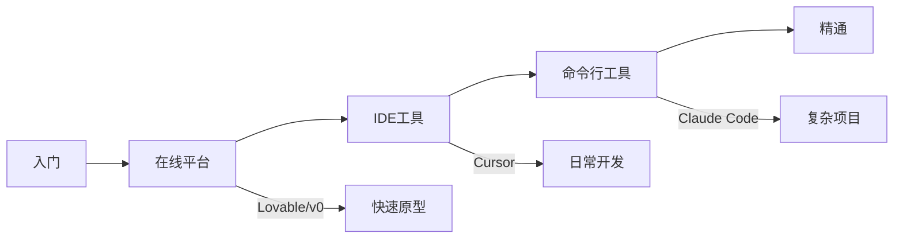

# Vibe Coding 从入门到精通

> [!quote] 核心理念
> "There's a new kind of coding I call 'vibe coding', where you fully give in to the vibes, embrace exponentials, and forget that the code even exists."
> — **Andrej Karpathy**, 2025年2月（原文：https://x.com/karpathy/status/1886192184808149383）

## 文档导航

> [!tip] 快速开始
> 如果你是完全的新手，建议按顺序阅读。如果已有基础，可直接跳转到感兴趣的章节。

---

## ⏱️ 10 分钟快速上手

> [!success] 目标
> 完全零基础，10 分钟内跑通第一个 AI 生成的应用

### 路径 A：最快上手（无需安装，3 分钟）

1. 打开 [Lovable](https://lovable.dev) 或 [v0.dev](https://v0.dev)
2. 注册/登录（支持 Google/GitHub）
3. 输入提示词，例如：
   ```
   创建一个任务管理应用，包含：
   - 添加任务输入框
   - 任务列表，可标记完成
   - 蓝色主题
   ```
4. 等待生成 → 预览 → 部署 🎉

### 路径 B：命令行体验（5-10 分钟）

```bash
# 1. 安装 Claude Code（无需 Node.js）
curl -fsSL https://claude.ai/install.sh | bash

# 2. 进入任意项目目录
cd ~/my-project  # 或新建目录

# 3. 启动（首次会引导登录）
claude

# 4. 输入任务，例如：
#    > 帮我分析这个项目的代码结构
#    > 创建一个简单的 README.md
```

> [!note] 下一步
> 跑通后，继续阅读 [[09 - 在线平台入门]] 或 [[05 - Claude Code 安装配置]] 深入学习。

---

### 基础概念

| 章节 | 内容 | 适合人群 |
|------|------|---------|
| [[01 - 什么是 Vibe Coding]] | 定义、起源、行业现状 | 所有人 |
| [[02 - 为什么PM需要学习]] | 价值、场景、趋势 | 产品经理 |
| [[03 - 工具全景图]] | 工具分类与对比 | 所有人 |

### 工具安装

| 章节 | 内容 | 难度 |
|------|------|------|
| [[04 - 环境准备]] | Node.js 等基础环境 | ⭐ |
| [[05 - Claude Code 安装配置]] | 官方CLI工具 | ⭐⭐ |
| [[06 - Codex CLI 安装配置]] | OpenAI 命令行工具 | ⭐⭐ |
| [[07 - MCP 配置指南]] | Model Context Protocol | ⭐⭐⭐ |
| [[07.5 - 进阶工具与配置]] | ==OpenCode、Skills、Subagents== | ⭐⭐⭐ |

### 实战指南

| 章节 | 内容 | 推荐 |
|------|------|------|
| [[08 - IDE工具详解]] | Cursor、Windsurf | 日常开发 |
| [[09 - 在线平台入门]] | Lovable、v0、Bolt | ==快速上手== |
| [[10 - 提示词工程]] | 最佳实践与模板 | 必读 |

### 进阶内容

| 章节 | 内容 |
|------|------|
| [[11 - 安全与风险管理]] | 安全检查清单 |
| [[12 - 常见问题排查]] | FAQ与故障处理 |
| [[13 - 资源与参考]] | 官方文档链接 |

---

## 学习路径

> [!info] 可视化路径图
> 👉 [[学习路径图.canvas|点击查看完整学习路径图（Canvas）]]



| 阶段 | 推荐工具 | 适合场景 | 预计时间 |
|:---:|:---|:---|:---:|
| 🟢 入门 | Lovable / v0 | 零代码快速出原型 | 10 分钟 |
| 🟡 进阶 | Cursor / Windsurf | 日常开发、代码编辑 | 1-2 小时 |
| 🔴 精通 | Claude Code / Codex CLI | 复杂项目、自动化 | 半天+ |

## 快速参考

> [!important] 安装命令速查
> ```bash
> # Claude Code
> curl -fsSL https://claude.ai/install.sh | bash
> 
> # OpenCode（开源）
> curl -fsSL https://opencode.ai/install | bash
> 
> # Codex CLI
> npm i -g @openai/codex
> 
> # Copilot CLI（Public Preview，需 Node.js 22+）
> npm install -g @github/copilot
> 
> # Aider（开源）
> pip install aider-chat
> ```

---

## 相关资源

- [[快速参考卡片]]
- [[07.5 - 进阶工具与配置|进阶工具：OpenCode、Skills、Aider]]
- [[学习路径图.canvas|学习路径图（Canvas）]]

%% 这是一个隐藏的提示：文档持续更新中，欢迎团队成员补充 %%
